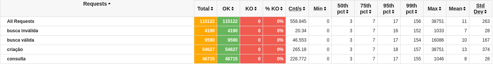

# Rinha de backend (Backend performance challenge) Vlang
[origin](https://github.com/zanfranceschi/rinha-de-backend-2023-q3)

This is my solution to the backend performance challenge. It's my first time using Vlang, and I'm in love with this language.

- Framework: vweb (built-in)
- DB: Postgresql

### Results



### How to run

#### [Install vlang](https://vlang.io/)

- Development
```bash
$ docker-compose -f docker-compose.dev.yml up
$ v run src
```

- Production
```bash
$ docker-compose up
```
